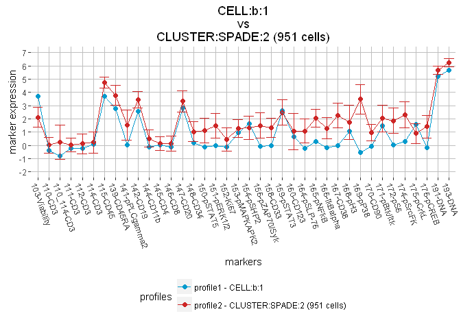
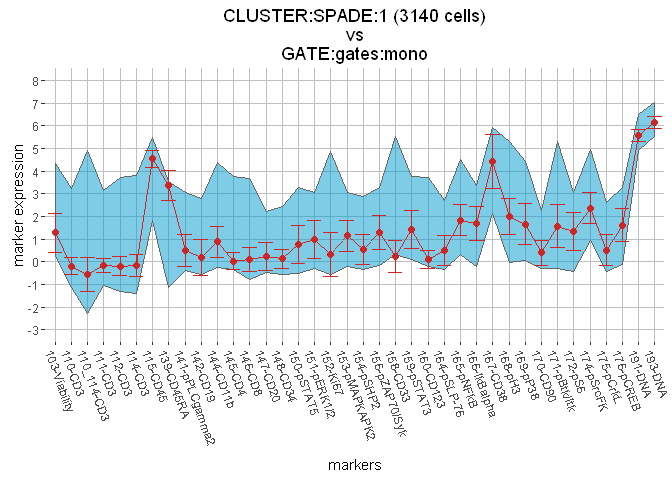
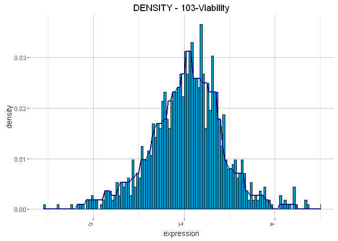

# CytoCompare: an R package for computational comparisons of cytometry profiles
Nicolas Tchitchek and Ludovic Platon  


# Table of Contents
1. [Package overview](#package_overview)
2. [Package installation](#package_installation)
3. [Structure of the cytometry objects](#object_structure)
    1. [CELL object structure](#cell_structure)
    2. [CLUSTER object structure](#cluster_structure)
    3. [GATE object structure](#gate_structure)
4. [Manipulation of the cytometry objects](#object_manipulation)
    1. [Cytometry object extraction](#object_extraction)
    2. [Cytometry object combination](#object_combination)
    3. [Cytometry object transformation](#object_transformation)
    4. [Cytometry object export](#object_export)
5. [Representations of the cytometry objects](#object_representation)
    1. [Cytometry object summarization](#object_summarization)
    2. [CELL object visualization](#cell_visualization)
    3. [CLUSTER object visualization](#cluster_visualization)
    4. [GATE object visualization](#gate_visualization)
    5. [Pairwise cytometry object visualization](#pairwise_visualization)
6. [Importation of the cytometry profiles](#object_importation)
    1. [The import.CELL() function](#cell_importation)
    2. [The import.FCS() function](#fcs_importation)
    3. [The import.VISNE() function](#visne_importation)
    4. [The import.CLUSTER() function](#cluster_importation)
    5. [The import.SPADE() function](#spade_importation)
    6. [The import.CITRUS() function](#citrus_importation)
    7. [The import.GATE() function](#gate_importation)
    8. [The import.GATINGML() function](#gatingml_importation)
7. [Comparisons of cytometry profiles](#object_comparison)
    1. [The compare() function](#compare_function)
    2. [CELL vs. CELL comparisons](#cell_cell_compare)
    3. [CLUSTER vs. CLUSTER comparisons](#cluster_cluster_compare)
    4. [GATE vs. GATE comparisons](#gate_gate_compare)
    5. [CELL vs. GATE comparisons](#cell_gate_compare)
    6. [CELL vs. CLUSTER comparisons](#cell_cluster_compare)
    7. [CLUSTER vs. GATE comparisons](#cluster_gate_compare)
8. [The RES object](#res_object)
    1. [RES object structure](#res_structure)
    2. [RES object summarization](#res_summarization)
    3. [RES object extraction](#res_extraction)
    4. [RES object combination](#res_combination)
    5. [RES object visualization](#res_visualization)
    6. [RES object D3.js visualization](#res_d3js)
        1. [RES object D3.js circular graph visualization](#res_d3js_circular)
        2. [RES object D3.js mds visualization](#res_d3js_mds)
9. [The MWEIGHTS object](#mweights_object)
    1. [MWEIGHTS object structure](#mweights_structure)
    2. [MWEIGHTS object summarization](#mweights_summarization)
    3. [MWEIGHTS object extraction](#mweights_extraction)
    4. [MWEIGHTS object set](#mweights_set)
    5. [MWEIGHTS object visualization](#mweights_visualization)
10. [The DENSITY object](#density_object)
    1. [DENSITY object structure](#density_structure)
    2. [DENSITY object summarization](#density_summarization)
    3. [DENSITY object visualization](#density_visualization)
11. [Miscellaneous functions](#miscellaneous)
    1. [Biplot representations of CELL objects](#biplot)
    2. [Density heatmap representations of CLUSTER objects](#dheatmap)
12. [The compare() function template](#compare_template)
13. [License](#license)
14. [References](#references)

# <a name="package_overview"></a> 1. Package overview

Flow and mass cytometry are experimental techniques used to characterize cells at a single-cell level. Both techniques use labelled antibodies to measure cell markers. Flow cytometry uses antibodies conjugated with fluorochromes to quantify stained cells with a laser detection system, and recently introduced mass cytometry ([CyTOF](https://www.fluidigm.com/products/cytof) [[1](http://www.ncbi.nlm.nih.gov/pubmed/21551058)]) uses antibodies conjugated with metals to quantify stained cells with a mass spectrometer. While flow cytometry can currently handle up to 18 fluorochromes, mass cytometry can currently handle up to 40 metals. Mass cytometry offers important perspectives as it can potentially evaluate more than 100 metals. Additionally, another recently introduced cytometry technique, called hyperspectral cytometry technique [[2](http://www.ncbi.nlm.nih.gov/pubmed/24271566)], combines ultrafast optical spectroscopy with flow cytometry and can also increase up to 40 the number of simultaneously usable fluorochromes by avoiding spectral overlaps. Such significant technological improvements make flow and mass cytometry suitable for massive datamining and bioinformatics developments, in order to better explore and analyze complex cell interaction systems.

Cytometry data can be manually analyzed using a gating strategy (hierarchical gating usually followed by Boolean gating) or using automatic gating/clustering algorithms.
In both approaches, the aim is to identify cell populations having similar profiles, based on the expressions of selected markers.
Hierarchical gating is done using biplot representations, where each axis represents the intensity of a marker of interest and where dots represent the cells. Through iterative steps, operators select cell subsets and explore their marker expression profiles. Boolean gating is done by quantifying cells present within all possible combinations of gates for a population of interest. Even if Boolean gating can be done in an automatic way, gates still have to be delineated for each cell marker. FlowJo [[3](http://www.flowjo.com)] and CytoBank [[4](https://www.cytobank.org)] are among the most common software for manual gating. Both hierarchical and Boolean gating can be very fastidious and biased. 
The difficulty mainly comes from the high dimensionality of data, that is to say from the high number of markers and cell populations. This task becomes even more complicated as the number of markers increases or as the studies become more complex. 
On the other hand, automatic gating methods (such as [SPADE](http://cytospade.org/) [[5](http://www.ncbi.nlm.nih.gov/pubmed/21964415)] or [Citrus](https://github.com/nolanlab/citrus/wiki) [[6](http://www.ncbi.nlm.nih.gov/pubmed/24979804
)]) use various algorithms to computationally identify cell populations having similar profiles and provides then less biased results. Moreover, several dimensionality reduction  tools, such as viSNE [[7](http://www.ncbi.nlm.nih.gov/pubmed/23685480)], have been proposed to better visualize cells in cytometry profiles. Once identified cell populations, also named cell clusters, need to be deeper characterized or associated with known phenotypes for further investigations. 

Characterization of identified cell populations is a challenge becoming increasingly dominant in cytometry analyses. 
A typical task in this characterization process is to identify similar cell populations within a study or among different studies. Indeed, automatic gating methods can generate a large number of cell clusters, with overlapping marker expression phenotypes, that need to be organized further. Comparisons of cell cluster profiles among different studies can also reveal the effects of the clustering parameters or the experimental conditions. Another typical task in this characterization process is to identify included cytometry profiles, such as cell or cell cluster profiles included in gate profiles. Moreover, the identification of cell profiles included in cell cluster profiles or in gate profiles can also be relevant for the characterization of the cytometry profiles.

There is currently a lack of computational methods allowing to compare cytometry profiles, in order to identify *similar* profiles or to identify *included* profiles. These absences are critical as these operations have to be done manually and are intrinsically subject to bias.

To answer this need we designed CytoCompare, an R package allowing to compare cytometry profiles obtained from various sources, based on the characteristics of cell markers specified by the user.
Three types of cytometry profiles can be handled by CytoCompare: 

  1. the `CELL` object can handles cell profiles, modelled by intensities of expression markers
  2. the `CLUSTER` object can handles cell cluster profiles, modelled by means and standard deviations of expression markers or by densities of expression markers
  3. the `GATE` object can handles gate profiles, modelled by intensity ranges of expression markers

Each of these cytometry objects (`CELL`, `CLUSTER`, or `GATE` objects) can contain one or several cytometry profiles. 

For each comparison of two cytometry profiles, CytoCompare computes a similarity measure or an inclusion measure. A p-value, asserting the significance of the similarity or the inclusion, is also computed for each comparison of two profiles. 

We designed CytoCompare in a way that it can be easily used by non bioinformatician experts, but can also be easily customizable by users with more expertise in bioinformatics. CytoCompare offers many visualization representations to make comparison results and intermediary objects easily understandable (such as parallel coordinates, Multidimensional scaling or cicular graphs representations). Throught the multiple profiles manipulation methods, CytoCompare is also a powerful analysis pipeline for high-dimensional cytometry data.


# <a name="package_installation"></a> 2. Package installation
The `ggplot2`, `ggrepel`, `grid`, `igraph`, `MASS`, `RJSONIO`, and `XML` R packages as well as the `flowCore` and `flowUtils` Bioconductor packages are required for running CytoCompare. These packages can be installed using the following commands:

```r
install.packages('ggplot2')
install.packages('ggrepel')
install.packages('grid')
install.packages('igraph')
install.packages('MASS')
install.packages('RJSONIO')
install.packages('XML')

source("http://bioconductor.org/biocLite.R")
biocLite(suppressUpdates=TRUE)
biocLite("flowCore",suppressUpdates=TRUE)
biocLite("flowUtils",suppressUpdates=TRUE)
```

Alternatively, the `install.requiredpackages()` function of the CytoCompare package can be used to install these packages.

CytoCompare is available on [GitHub](https://github.com/), at https://github.com/tchitchek-lab/CytoCompare. Its installation can be done via the `devtools` package using the following commands:

```r
install.packages('devtools')
library("devtools")
install_github('tchitchek-lab/CytoCompare')
```

Once installed, CytoCompare can be loaded using the following command:

```r
library("CytoCompare")
```

An example dataset, obtained from public mass cytometry data [[5](http://www.ncbi.nlm.nih.gov/pubmed/21964415)], is available in CytoCompare. This example dataset consists on three cytometry profiles from healthy human bone marrow samples, unstimulated or stimulated by BCR or IL-7, and measured using a mass cytometry panel of more than 30 cell markers. This panel has been designed to identify a large spectrum of immune cell types. A SPADE analysis has been performed to identify cell clusters profiles that have then been manually labelled based on their marker expressions [[5](http://www.ncbi.nlm.nih.gov/pubmed/21964415)]. SPADE cell clusters corresponding to six majors cell types (B, CD33+ monocytes, naive or memory CD4+ T cells, and naive or memory CD8+ T cells) have been extracted. Furthermore, a set of gates have been constructed based on these six major cell types.

The raw data and the R object (`CytoCompareExample.rdata`) corresponding to this example dataset are available on a public ftp server: ftp://cytocompare.org/public/.

The R object containing the example dataset can be directly downloaded and loaded in the current R session using the following command:


```r
 # downloads the 'CytoCompareExample.rdata' file on the current folder, if no such file exists, and load it into the current R session
load.examples()
```

Once downloaded, the following objects will be available:

* `bm_example.cells.b`, a `CELL` object containing the cell profiles of the B cell populations
* `bm_example.cells.mono`, a `CELL` object containing the cell profiles of the monocyte cell populations
* `bm_example.cells.tCD4naive`, a `CELL` object containing the cell profiles of the naive CD4+ T cell populations
* `bm_example.cells.tCD8naive`, a `CELL` object containing the cell profiles of the naive CD8+ T cell populations
* `bm_example.cells.tCD4mem`, a `CELL` object containing the cell profiles of the memory CD4+ T cell populations
* `bm_example.cells.tCD8mem`, a `CELL` object containing the cell profiles of the memory CD8+ T cell populations
* `bm_example.clusters`, a `CLUSTER` object containing the cell cluster profiles for all the different cell populations identified by SPADE
* `bm_example.clusters.b`, a `CLUSTER` object containing the cell cluster profiles of the B cell populations identified by SPADE
* `bm_example.clusters.mono`, a `CLUSTER` object containing the cell cluster profiles of the monocyte cell populations  identified by SPADE
* `bm_example.clusters.tCD4naive`, a `CLUSTER` object containing the cell cluster profiles of the naive CD4+ T cell populations identified by SPADE
* `bm_example.clusters.tCD8naive`, a `CLUSTER` object containing the cell cluster profiles of the naive CD8+ T cell populations identified by SPADE
* `bm_example.clusters.tCD4mem`, a `CLUSTER` object containing the cell cluster profiles of the memory CD4+ T cell populations identified by SPADE
* `bm_example.clusters.tCD8mem`, a `CLUSTER` object containing the cell cluster profiles of the memory CD8+ T cell populations identified by SPADE
* `bm_example.gates`, a `GATE` object containing the gate profiles constructed based on the 6 main cell populations identified by SPADE
* `bm_example.gates.b`, a `GATE` object containing the gate profiles constructed based on the B cell populations
* `bm_example.gates.mono`, a `GATE` object containing the gate profiles constructed based on the monocyte cell populations
* `bm_example.gates.tCD4naive`, a `GATE` object containing the gate profiles constructed based on the naive CD4+ T cell populations
* `bm_example.gates.tCD8naive`, a `GATE` object containing the gate profiles constructed based on the naive CD8+ T cell populations
* `bm_example.gates.tCD4mem`, a `GATE` object containing the gate profiles constructed based on the memory CD4+ T cell populations
* `bm_example.gates.tCD8mem`, a `GATE` object containing the gate profiles constructed based on the memory CD8+ T cell populations
* `bm_example.mweights`, a `MWEIGHTS` object containing markers that can be used for the comparison computations
* `bm_example.visne`, a list of three `CELL` objects containing the viSNE cell profiles for each biological sample


# <a name="object_structure"> 3. Structure of the cytometry objects</a>

## <a name="cell_structure"></a> 3.1. CELL object structure
The `CELL` object is a S4 object containing one or several cell profiles. This object mainly stores for each cell profile: the intensities of each marker.

Different slots are available for a given `CELL` object:

* the slot `name` is a character indicating the internal name of the `CELL` object
* the slot `profiles` is a character vector containing the names of the cell profiles 
* the slot `profiles.nb` is an integer value indicating the number of cell profiles
* the slot `markers` is a character vector containing the marker names
* the slot `markers.nb` is an integer value indicating the number of markers
* the slot `intensities` is a numeric matrix containing the intensities of each marker for each cell profile
* the slot `overview.function` is a character specifying the name of a function to call when plotting the `CELL` object overview (please refer to the documentation of the `plot()` function)
* the slot `layout` is a numeric matrix that can be used to store the positions of cells in a 2-dimensional space (e.g. tSNE1 and tSNE2 dimensions provided by viSNE)


##<a name="cluster_structure"></a> 3.2. CLUSTER object structure
The `CLUSTER` object is a S4 object containing one or several cell cluster profiles. This object mainly stores for each cell cluster profile: the means, the standard deviations and the densities of each marker.

Different slots are available for a given `CLUSTER` object:

* the slot `name` is a character indicating the internal name of the `CLUSTER` object
* the slot `profiles` is a character vector containing the names of the cell cluster profiles
* the slot `profiles.nb` is an integer value indicating the number of cell cluster profiles
* the slot `profiles.sizes` is an integer vector indicating the number of cells associated to each cluster profile
* the slot `markers` is a character vector containing the marker names
* the slot `markers.nb` is an integer value indicating the number of markers
* the slot `markers.clustering` is a logical vector specifying the markers used as clustering markers
* the slot `means` is a numeric matrix containing the means of each marker for each cluster profile
* the slot `sd` is a numeric matrix containing the standard deviations of each marker for each cluster profile
* the slot `densities` is a matrix of `DENSITY` objects containing the density of each marker for each cluster profile
* the slot `overview.function` is a character specifying the name of a function to call when plotting the `CLUSTER` object overview (please refer to the documentation of the `plot()` function)
* the slot `graph` is an object that can be used to store a visual representation of the cell clusters (e.g. a SPADE tree)
* the slot `graph.layout` is a numeric matrix that can be used to store the positions of cell clusters in a 2-dimensional space (e.g. a SPADE tree layout)


## <a name="gate_structure"></a> 3.3. GATE object structure
The `GATE` object is a S4 object containing one or several gate profiles. This object mainly stores for each gate profile: the intensity ranges of each marker. 

Different slots are available for a given `GATE` object:

* the slot `name` is a character indicating the internal name of the `GATE` object
* the slot `profiles` is a character vector containing the names of the gate profiles
* the slot `profiles.nb` is an integer value indicating the number of cell gate profiles
* the slot `markers` is a character vector containing the marker names
* the slot `markers.nb` is an integer value indicating the number of markers
* the slot `ranges` is a 3-dimensional numeric array containing the intensity ranges of each marker for each gate profile


# <a name="object_manipulation"></a> 4. Manipulation of the cytometry objects

## <a name="object_extraction"></a> 4.1. Cytometry object extraction
The extract function `[i,j]` can be used to extract subsets of `CELL`, `CLUSTER`, or `GATE` objects. The parameter `i` represents a vector of profiles to extract and the parameter `j` represents a vector of markers to extract. Both `i` and `j` can be numeric, logical or character vectors.

For example subsets of a `CELL` object can be extracted using the following commands:

```r
# extracts the first 10 cell profiles of a given CELL object
bcells.subset1 <- bm_example.cells.b[1:10]
# extracts the first 10 cell profiles and extracts 3 markers of a given CELL object
bcells.subset2 <- bm_example.cells.b[1:10,c("110-CD3"," 110_114-CD3","111-CD3")]
```

For example subsets of a `CLUSTER` object can be extracted using the following commands:

```r
# extracts some specific cell cluster profiles of a given CLUSTER object
monoclusters.subset1 <- bm_example.clusters.mono[c(1,3,5,7,11)]
# extracts the first 10 cell profiles and extracts some markers of a given CLUSTER object 
monoclusters.subset2 <- bm_example.clusters.mono[1:10,5:10]
```

For example subsets of a `GATE` object can be extracted using the following commands:

```r
# extracts a specific gate profile of a given GATE object
gates.subset1 <- bm_example.gates["tCD4mem"]
# extracts two gate profiles and extracts some markers of a given GATE object 
gates.subset2 <- bm_example.gates[c("tCD4naive","tCD8naive"),c(1,2,3,4,5)]
```


## <a name="object_combination"></a> 4.2. Cytometry object combination
The combine function `c()` can be used to combine two or several `CELL`, `CLUSTER`, or `GATE` objects. All the different objects to combine must be of the same type.

This function is especially useful when combining cell profiles obtained from different FCS files into one single `CELL` object. 

A combination of two or more cytometry objects can be done using the following commands:

```r
# combines a set of CELL objects into a single CELL object
tcells.combine1 <- c(bm_example.cells.tCD4mem,
                           bm_example.cells.tCD4naive,
                           bm_example.cells.tCD8mem,
                           bm_example.cells.tCD8naive)

# combines a list of CELL objects into a single CELL object
tcells.list <- list(bm_example.cells.tCD4mem,
                 bm_example.cells.tCD4naive,
                 bm_example.cells.tCD8mem,
                 bm_example.cells.tCD8naive)
tcells.combine2 <- do.call("c",tcells.list)
```

## <a name="object_transformation"></a> 4.3. Cytometry object transformation
The `as.CELL()` function can be used to coerce a given numeric matrix into a `CELL` object. It is to note that the numeric matrix must have its columns named (which correspond to the marker names). Such coercion can be done using the following commands:

```r
# coerces a given numeric matrix into a CELL object
cells <- matrix(runif(100*20,min=0,max=5),nrow=100,ncol=20) # generates a random numeric matrix
colnames(cells) <- paste0("marker_",as.character(1:ncol(cells))) # names the column names of the numeric matrix
cell.frommatrix <- as.CELL(cells)
```

The `as.CLUSTER()` function can be used to coerce a given `CELL` object into a `CLUSTER` object. 
This function transforms the cell profiles into cell cluster profiles by computing the means, standard deviations, and densities for each marker. Such coercion can be done using the following command:

```r
# coerces a given CELL object into a CLUSTER object
cluster.fromcell <- as.CLUSTER(bm_example.cells.b)
```

The `as.GATE()` function can be used to coerce a given `CLUSTER` or a given `CELL` object into a `GATE` object.
This function transforms the cell or cell cluster profiles into gate profiles by computing the intensity ranges for each marker. By default the intensity ranges are computed based on the 0.01 and 0.99 quantiles, but can be specified by the user. Such coercions can be done using the following commands:

```r
# coerces a given CELL object into a GATE object based on the 0.01 and 0.99 quantiles
gate.fromcell1 <- as.GATE(bm_example.cells.mono)
# coerces a given CELL object into a GATE object based on the 0.05 and 0.95 quantiles
gate.fromcell2 <- as.GATE(bm_example.cells.mono, quantiles=c(0.05,0.95))
# coerces a given CELL object into a GATE object based on the minimal and maximal intensities
gate.fromcell3 <- as.GATE(bm_example.cells.mono, quantiles=c(0,1))
```

## <a name="object_export"></a> 4.4. Cytometry object export
The `export()` function can be used to export a `CELL` object into a FCS file or export a `GATE` object into a GatingML-XML file.

An export of a `CELL` object can be done using the following command:

```r
# exports a given CELL object to a FCS file
export(bm_example.cells.tCD4mem,"cell.fcs")
```

An export of a `GATE` object can be done using the following command:

```r
# exports the summary of a given CELL object to an GatingML-XML file
export(bm_example.gates.b,"gate.xml")
```

# <a name="object_representation"></a> 5. Representations of the cytometry objects

## <a name="object_summarization"></a> 5.1. Cytometry object summarization
The `print()` or `show()` functions can be used to display a summary of the `CELL`, `CLUSTER` and `GATE` objects.

A textual representation of the cytometry objects can be displayed using the following commands:

```r
# prints the summary of a given CELL object
print(bm_example.cells.tCD4mem)
```

```
## Object class: CELL
## Object name: tCD4mem
## Number of cell profiles: 81725
## Number of markers: 38
## Markers: 103-Viability; 110-CD3; 110_114-CD3; 111-CD3; 112-CD3; 114-CD3; 115-CD45; 139-CD45RA; 141-pPLCgamma2; 142-CD19; 144-CD11b; 145-CD4; 146-CD8; 147-CD20; 148-CD34; 150-pSTAT5; 151-pERK1/2; 152-Ki67; 153-pMAPKAPK2; 154-pSHP2; 156-pZAP70/Syk; 158-CD33; 159-pSTAT3; 160-CD123; 164-pSLP-76; 165-pNFkB; 166-IkBalpha; 167-CD38; 168-pH3; 169-pP38; 170-CD90; 171-pBtk/Itk; 172-pS6; 174-pSrcFK; 175-pCrkL; 176-pCREB; 191-DNA; 193-DNA
```


```r
# prints the summary of a given CLUSTER object
print(bm_example.clusters.tCD4mem)
```

```
## Object class: CLUSTER
## Object name: tCD4mem
## Number of clusters profiles: 21
## Markers: 103-Viability; 110-CD3; 110_114-CD3; 111-CD3; 112-CD3; 114-CD3; 115-CD45; 139-CD45RA; 141-pPLCgamma2; 142-CD19; 144-CD11b; 145-CD4; 146-CD8; 147-CD20; 148-CD34; 150-pSTAT5; 151-pERK1/2; 152-Ki67; 153-pMAPKAPK2; 154-pSHP2; 156-pZAP70/Syk; 158-CD33; 159-pSTAT3; 160-CD123; 164-pSLP-76; 165-pNFkB; 166-IkBalpha; 167-CD38; 168-pH3; 169-pP38; 170-CD90; 171-pBtk/Itk; 172-pS6; 174-pSrcFK; 175-pCrkL; 176-pCREB; 191-DNA; 193-DNA
## Number of markers: 38
## Clustering markers: 110_114-CD3; 115-CD45; 139-CD45RA; 142-CD19; 144-CD11b; 145-CD4; 146-CD8; 147-CD20; 148-CD34; 158-CD33; 160-CD123; 167-CD38; 170-CD90
## Number of clustering markers: 13
## Density bin width: 0.05
## Cluster profile names and number of associated cells:
##  224: 8625 cells
##  223: 10572 cells
##  207: 11471 cells
##  239: 5012 cells
##  128: 5657 cells
##  27: 5170 cells
##  67: 261 cells
##  172: 2799 cells
##  81: 484 cells
##  221: 7374 cells
##  139: 1201 cells
##  243: 4738 cells
##  146: 987 cells
##  251: 5456 cells
##  49: 616 cells
##  253: 5690 cells
##  59: 244 cells
##  42: 2053 cells
##  175: 2094 cells
##  37: 239 cells
##  98: 982 cells
```


```r
# shows the summary of a given GATE object
show(bm_example.gates)
```

```
## Object class: GATE
## Object name: gates
## Number of gate profiles: 6
## Markers: 103-Viability; 110-CD3; 110_114-CD3; 111-CD3; 112-CD3; 114-CD3; 115-CD45; 139-CD45RA; 141-pPLCgamma2; 142-CD19; 144-CD11b; 145-CD4; 146-CD8; 147-CD20; 148-CD34; 150-pSTAT5; 151-pERK1/2; 152-Ki67; 153-pMAPKAPK2; 154-pSHP2; 156-pZAP70/Syk; 158-CD33; 159-pSTAT3; 160-CD123; 164-pSLP-76; 165-pNFkB; 166-IkBalpha; 167-CD38; 168-pH3; 169-pP38; 170-CD90; 171-pBtk/Itk; 172-pS6; 174-pSrcFK; 175-pCrkL; 176-pCREB; 191-DNA; 193-DNA
## Number of markers: 38
## Gate profile names: 
##  b
##  mono
##  tCD4mem
##  tCD8mem
##  tCD4naive
##  tCD8naive
```


## <a name="cell_visualization"></a> 5.2. CELL object visualization
The `plot()` function can be used to plot cell profiles of a `CELL` object, via parallel coordinates where the x-axis represents the different markers and where the y-axis represents the marker expressions. Representations are generated using the `ggplot2` library [10] and can be modified by users.

A `CELL` object, which contains one or several cell profiles, can be plotted using the following command:

```r
# plots the first cell profile of a CELL object
plot(bm_example.cells.tCD4mem[1])
```


If the `CELL` object contains several cell profiles, then all the different cell profiles will be plotted separately using the following command:

```r
# plots the first 3 cell profiles of a CELL object
plot(bm_example.cells.tCD4mem[1:3])
```


If `CELL` object has been imported via a viSNE FCS file, then biplot overview representations of the cell objects is possible using the following commands:

```r
# plots overviews of CELL objects imported from viSNE FCS files
plot(bm_example.visne[[1]],overview=TRUE)
```


```r
plot(bm_example.visne[[2]],overview=TRUE)
```


```r
plot(bm_example.visne[[3]],overview=TRUE)
```


ViSNE representation aims to visualize cell profiles in a 2-dimensional space using a dimensionality reduction process. For each cell profile a 2-dimensional coordinate is calculated. The 2 dimensions are named tSNE1 and tSNE2.


## <a name="cluster_visualization"></a> 5.3. CLUSTER object visualization
The `plot()` function can be used to plot cell cluster profiles of a `CLUSTER` object, via parallel coordinates where the x-axis represents the different markers, where the y-axis represents the marker expressions, and where error bars indicate the marker expression standard deviations. Representations are generated using the `ggplot2` library [10] and can be modified by users.
 
A `CLUSTER` object, which contains one or several cell cluster profiles, can be plotted using the following command:

```r
# plots the second cell cluster profile of a CLUSTER object
plot(bm_example.clusters[2])
```


If the `CLUSTER` object contains several cell cluster profiles, then all the different cell cluster profiles will be plotted separately using the following command:

```r
# plots the first 3 cell cluster profiles of a CLUSTER object
plot(bm_example.clusters[1:3])
```


If a `CLUSTER` object has been imported via SPADE result files, then a SPADE tree overview representation of the cluster object is possible using the following command:

```r
# plots an overview of a CLUSTER object imported from SPADE result files
plot(bm_example.clusters,overview=TRUE)
```


In a SPADE tree representation, each node represents a cell cluster and similar cell clusters are linked using a minimal spanning tree approach. The sizes of the nodes are proportional to the amount of cells present within each cluster.


## <a name="gate_visualization"></a> 5.4. GATE object visualization
The `plot()` function can be used to plot gate profiles of a `GATE` object, via ribbons where the x-axis represents the different markers and where the y-axis represents the marker intensity ranges. Representations are generated using the `ggplot2` library [10] and can be modified by users.

A `GATE` object, which contains one or several gates profiles, can be plotted using the following command:

```r
# plots the first gate profile of a GATE object and restricts it to the 30 first markers
plot(bm_example.gates[1,1:30])
```


If the `GATE` object contains several gate profiles, then all the different gate profiles will be plotted separately using the following command:

```r
# plots the first 3 gate profiles of a GATE object
plot(bm_example.gates[1:3])
```


## <a name="pairwise_visualization"></a> 5.5. Pairwise cytometry object visualization
Two cytometry profiles can be visualized in one single representation using the `plot()` function. Such representations are especially useful to better visualize the marker similarities or inclusions between two cytometry profiles. All combinations of representations, between two cytometry profiles, are possible and can be performed using the following commands: 


```r
# plots two cell profiles in one single representation
plot(bm_example.cells.b[1],bm_example.cells.mono[2])
```


```r
# plots two cell cluster profiles in one single representation
plot(bm_example.clusters[1],bm_example.clusters[2])
```


```r
# plots two gate profiles in one single representation
plot(bm_example.gates[1],bm_example.gates[2])
```


```r
# plots a cell profile and a cell cluster profile in one single representation
plot(bm_example.cells.b[1],bm_example.clusters[2])
```




```r
# plots a cell profile and a gate profile in one single representation
plot(bm_example.cells.b[1],bm_example.gates[2])
```


```r
# plots a cell cluster profile and a gate profile in one single representation
plot(bm_example.clusters[1],bm_example.gates[2])
```




# <a name="object_importation"></a> 6. Importation of the cytometry profiles 

## <a name="cell_importation"></a> 6.1. The import.CELL() function
The `import.CELL()` function imports one or several cell profiles from a tab separated file into a `CELL` object. Such tab separated file must contain for each cell profile the intensities of the marker and must be formatted as the following:

* each row must represent a cell profile
* each column must represent a marker
* each cell in the table must contain the marker expression intensities for a given cell profile

The first column must contain the cell names and the first row must contain the marker names.

A typical tab separated file to import must look like the following:

|         | marker\_1 | marker\_2 | marker\_3 | marker\_4 | marker\_5 | marker\_x | marker\_n |
|---------|-----------|-----------|-----------|-----------|-----------|-----------|-----------|
| cell\_1 |    5.23   |    0.42   |    4.26   |    3.23   |    1.57   |    3.14   |    6.01   | 
| cell\_2 |    2.56   |    2.34   |    5.45   |    2.34   |    1.27   |    1.70   |    6.32   | 
| cell\_3 |    2.67   |    4.10   |    4.56   |    3.56   |    0.89   |    0.42   |    4.32   | 
| cell\_4 |    4.33   |    4.32   |    3.89   |    3.45   |    3.45   |    5.07   |    5.65   | 
| cell\_5 |    5.24   |    2.76   |    5.08   |    2.56   |    5.23   |    4.98   |    7.98   | 


An import of a such file can be done using the following command:


```r
# imports a tab separated file containing several cell profiles 
imported.cells <- import.CELL('./CELL.TXT/cells.txt')
```

Some parameters can be specified to rename the marker names or to exclude some markers in the import procedure:

* the `dictionary` parameter is a two-column data.frame providing the correspondence between the original marker names (first column) and the new marker names (second column)
* the `exclude` parameter is a character vector containing the marker names to be excluded in the import procedure

A summary of the `CELL` object, imported by the `import.CELL()` function, can be done using the following command:

```r
print(imported.cells)
```

```
## Object class: CELL
## Object name: cells.txt
## Number of cell profiles: 5
## Number of markers: 7
## Markers: marker_1; marker_2; marker_3; marker_4; marker_5; marker_x; marker_n
```


## <a name="fcs_importation"></a> 6.2. The import.FCS() function
The `import.FCS()` function imports cell profiles from a Flow Cytometry Standard ([FCS](http://isac-net.org/Resources-for-Cytometrists/Data-Standards/Data-File-Standards/Flow-Cytometry-Data-File-Format-Standards.aspx) [8]) file into a `CELL` object. The FCS is a standard file format used to store flow and mass cytometry data. These files mainly store the intensities of each marker for each cell profile.
CytoCompare can handles for now the same FCS file versions as supported in the [flowCore](http://www.bioconductor.org/packages/release/bioc/html/flowCore.html) [9] Bioconductor package (FCS versions 1.0, 2.0, 3.0 and 3.1).

An import of a FCS file can be done using the following command:


```r
# imports a FCS containing several cell profiles 
imported.fcs <- import.FCS('./CELL.FCS/Bcells/Marrow1_01_Basal1_Singlets_B cells.fcs')
```

Some parameters can be specified to rename the marker names, to apply numeric transformations on the marker expression values, or to exclude some markers in the import or transformation procedures:

* the `dictionary` parameter is a two-column data.frame providing the correspondence between the original marker names (first column) and the new marker names (second column)
* the `exclude` parameter is a character vector containing the marker names to be excluded in the import procedure
* the `trans` parameter is a character specifying the name of a transformation function to apply on the marker expression intensities. Possible functions are "arcsinh" for arc sin hyperbolic transformation (default), "log" for logarithmic transformation, or "none" for no transformation 
* the `trans.para` parameter is a character named list containing parameters for the transformation
* the `trans.exclude` parameter is a character vector containing the marker names for which no transformation will be applied on


The available transformation functions are (`trans` parameter):

* `"arcsinh"` for an arc sine hyperbolic transformation of the data (default choice)
* `"log"` for a logarithmic transformation of the data
* `"none"` for no transformation of the data

The available transformation parameters are (`trans.para` parameter):

* for the `"arcsinh"` transformation, the scale (cofactor) can be specified using the `arcsinh.scale` parameter
* for the `"log"` transformation, the base and the shift can be specified using the `log.base` and `log.shift` parameters

If a set of files is specified, then the files are merged in the import procedure.

An import of a FCS file using a `"log"` transformation in base 10 with a shift of 1 and using the `exclude` parameter can be made using the following command:


```r
# imports a tab separated file containing several cell profiles with some import specifications
imported.fcs <- import.FCS('./CELL.FCS/Bcells/Marrow1_01_Basal1_Singlets_B cells.fcs', trans="log", trans.para=list(log.base=10,log.shift=1), exclude=c("Cell_length"))
```

A summary of a `CELL` object, imported by the `import.FCS()` function, can be done using the following command:

```r
print(imported.fcs)
```

```
## Object class: CELL
## Object name: Marrow1_01_Basal1_Singlets_B cells.fcs
## Number of cell profiles: 14198
## Number of markers: 42
## Markers: Time; Ir(190.960)-Dual; Ir(192.962)-Dual; Rh(102.905)-Dual; In(114.903)-Dual; Cd(109.903)-Dual; Cd(110.904)-Dual; Cd(111.902)-Dual; Cd(113.903)-Dual; La(138.906)-Dual; Pr(140.907)-Dual; Nd(141.907)-Dual; Nd(143.910)-Dual; Nd(144.912)-Dual; Nd(145.913)-Dual; Nd(147.916)-Dual; Nd(149.920)-Dual; Sm(146.914)-Dual; Sm(151.919)-Dual; Sm(153.922)-Dual; Eu(150.919)-Dual; Eu(152.921)-Dual; Gd(155.922)-Dual; Gd(157.924)-Dual; Gd(159.927)-Dual; Tb(158.925)-Dual; Dy(163.929)-Dual; Ho(164.930)-Dual; Er(165.930)-Dual; Er(166.932)-Dual; Er(167.932)-Dual; Er(169.935)-Dual; Tm(168.934)-Dual; Yb(170.936)-Dual; Yb(171.936)-Dual; Yb(173.938)-Dual; Yb(175.942)-Dual; Lu(174.940)-Dual; Cd(110,111,112,114); absoluteEventNumber; density; cluster
```


## <a name="visne_importation"></a> 6.3. The import.VISNE() function
The `import.VISNE()` function imports cell profiles from viSNE FCS files into a `CELL` object. viSNE is a visualization algorithm for high-dimensional cytometry data [[7](http://www.ncbi.nlm.nih.gov/pubmed/23685480)]. ViSNE aims to represent cell profiles in a 2-dimensional space using a dimensionality reduction process. For each cell profile a 2-dimensional coordinate is calculated. The 2 dimensions are named tSNE1 and tSNE2 and the results are presented via FCS files having two extra markers corresponding to these dimensions.  

An import of a viSNE FCS file can be done using the following command:


```r
# imports a viSNE FCS file containing several cell profiles 
imported.visne <- import.VISNE('./CELL.viSNE/Marrow1_01_Basal1_Singlets_viSNE.fcs')
```

Some parameters can be specified to rename the marker names, to apply numeric transformations on the marker expression values, or to exclude some markers in the import or transformation procedures:

* the `dictionary` parameter is a two-column data.frame providing the correspondence between the original marker names (first column) and the new marker names (second column)
* the `exclude` parameter is a character vector containing the marker names to be excluded in the import procedure
* the `trans` parameter is a character specifying the name of a transformation function to apply on the marker expression intensities. Possible functions are "arcsinh" for arc sin hyperbolic transformation (default), "log" for logarithmic transformation, or "none" for no transformation 
* the `trans.para` parameter is a character named list containing parameters for the transformation
* the `trans.exclude` parameter is a character vector containing the marker names for which no transformation will be applied on
* the `tSNE1` parameter is a character indicating the marker name of the first viSNE dimension (tSNE1)
* the `tSNE2` parameter is a character indicating the marker name of the second viSNE dimension (tSNE2)


The available transformation functions are (`trans` parameter):

* `"arcsinh"` for an arc sine hyperbolic transformation of the data (default choice)
* `"log"` for a logarithmic transformation of the data
* `"none"` for no transformation of the data

The available transformation parameters are (`trans.para` parameter):

* for the `"arcsinh"` transformation, the scale (cofactor) can be specified using the `arcsinh.scale` parameter
* for the `"log"` transformation, the base and the shift can be specified using the `log.base` and `log.shift` parameters


A summary of the `CELL` object, imported by the `import.VISNE()` function, can be done using the following command:

```r
print(imported.visne)
```

```
## Object class: CELL
## Object name: Marrow1_01_Basal1_Singlets_viSNE.fcs
## Number of cell profiles: 10000
## Number of markers: 44
## Markers: Time; Cell_length; Ir(190.960)-Dual; Ir(192.962)-Dual; Rh(102.905)-Dual; In(114.903)-Dual; Cd(109.903)-Dual; Cd(110.904)-Dual; Cd(111.902)-Dual; Cd(113.903)-Dual; La(138.906)-Dual; Pr(140.907)-Dual; Nd(141.907)-Dual; Nd(143.910)-Dual; Nd(144.912)-Dual; Nd(145.913)-Dual; Nd(147.916)-Dual; Nd(149.920)-Dual; Sm(146.914)-Dual; Sm(151.919)-Dual; Sm(153.922)-Dual; Eu(150.919)-Dual; Eu(152.921)-Dual; Gd(155.922)-Dual; Gd(157.924)-Dual; Gd(159.927)-Dual; Tb(158.925)-Dual; Dy(163.929)-Dual; Ho(164.930)-Dual; Er(165.930)-Dual; Er(166.932)-Dual; Er(167.932)-Dual; Er(169.935)-Dual; Tm(168.934)-Dual; Yb(170.936)-Dual; Yb(171.936)-Dual; Yb(173.938)-Dual; Yb(175.942)-Dual; Lu(174.940)-Dual; Cd(110,111,112,114); absoluteEventNumber; density; tSNE1; tSNE2
```


## <a name="cluster_importation"></a> 6.4. The import.CLUSTER() function
The `import.CLUSTER()` function imports one or several cell cluster profiles from a tab separated file into a `CLUSTER` object. Such tab separated file must contain for each cell cluster profile the means and the standard deviations of the expression markers and must be formatted as the following:

* each row must represent a cell cluster profile
* each column must represent a marker
* each cell in the table must contain the marker expression means and the standard deviations for a given cell cluster separated by a semicolon

The first column must contain the cell cluster names and the first row must contain the marker names.

A typical tab separated file to import must look like the following:

|            | marker\_1 | marker\_2 | marker\_3 | marker\_4 | marker\_5 | marker\_x | marker\_n |
|------------|-----------|-----------|-----------|-----------|-----------|-----------|-----------|
| cluster\_1 | 5.23;0.94 | 0.42;0.88 | 4.26;0.33 | 3.23;2.73 | 1.57;1.69 | 3.14;1.71 | 6.01;2.40 | 
| cluster\_2 | 2.56;1.94 | 2.34;2.93 | 5.45;1.88 | 2.34;0.97 | 1.27;0.97 | 1.70;0.48 | 6.32;1.67 | 
| cluster\_3 | 2.67;0.36 | 4.10;0.74 | 4.56;2.80 | 3.56;1.29 | 0.89;0.53 | 0.42;0.54 | 4.32;1.39 | 
| cluster\_4 | 4.33;2.76 | 4.32;2.76 | 3.89;0.55 | 3.45;0.76 | 3.45;0.84 | 5.07;0.28 | 5.65;2.28 | 
| cluster\_5 | 5.24;1.75 | 2.76;0.63 | 5.08;2.17 | 2.56;0.93 | 5.23;1.99 | 4.98;1.30 | 7.98;0.67 | 


An import of a such file can be done using the following command:


```r
# imports a tab separated file containing several cell cluster profiles 
imported.clusters <- import.CLUSTER('./CLUSTER.TXT/clusters.txt')
```

Some parameters can be specified to rename the marker names or to exclude some markers in the import procedure:

* the `dictionary` parameter is a two-column data.frame providing the correspondence between the original marker names (first column) and the new marker names (second column)
* the `exclude` parameter is a character vector containing the marker names to be excluded in the import procedure

A summary of the `CLUSTER` object, imported by the `import.CLUSTER()` function, can be done using the following command:

```r
print(imported.clusters)
```

```
## Object class: CLUSTER
## Object name: clusters.txt
## Number of clusters profiles: 5
## Markers: marker_1; marker_2; marker_3; marker_4; marker_5; marker_x; marker_n
## Number of markers: 7
## Clustering markers: none
## Number of clustering markers: 0
## No Densities associated to marker expressions
## Cluster profile names and number of associated cells:
##  cluster_1: no associated number of cells
##  cluster_2: no associated number of cells
##  cluster_3: no associated number of cells
##  cluster_4: no associated number of cells
##  cluster_5: no associated number of cells
```

It is to note that `CLUSTER` objects constructed via the `import.CLUSTER()` function do not contain the densities of expression markers (please refer to the documentation of the `compare()` function).


## <a name="spade_importation"></a> 6.5. The import.SPADE() function
The `import.SPADE()` function imports cell cluster profiles identified by the SPADE algorithm into a `CLUSTER` object. The Spanning Tree Progression of Density Normalized Events ([SPADE](http://cytospade.org/) [5]) algorithm is a visualization and analysis algorithm for high-dimensional cytometry data, available in R or in [Cytobank](https://www.cytobank.org/) [4]. SPADE was designed to analyze mass cytometry data but can also handle flow cytometry data.

SPADE identifies clusters of cells having similar expression profiles for selected markers using an agglomerative hierarchical clustering-based algorithm combined with a density-based down-sampling procedure. Given a set of FCS files (usually one file per sample), SPADE identifies cell clusters based on the whole dataset and provides then for each sample the amount of cells present within each cluster.
The number of desired cell clusters to obtain needs to be specified by the user as well as some down-sampling parameters. 
SPADE represents its clustering results using a tree representation where each node represents a cell cluster and where similar cell clusters are linked using a minimal spanning tree approach.
In SPADE tree representations, the sizes of the nodes are proportional to the amount of cells present within each cluster. In order to characterize cell populations and to associate them with known phenotypes, nodes can be gradient-colored based on theirs mean expression intensities for a specific marker.

An import of SPADE clustering results can be done using the following command:


```r
# imports a SPADE folder containing several cell cluster profiles 
imported.spade <- import.SPADE('./CLUSTER.SPADE/')
```

Some parameters can be specified to rename the marker names, to apply numeric transformations on the marker expression values, to exclude some markers in the import or transformation procedures, or to specify how to extract a SPADE result archive:

* the `dictionary` parameter is a two-column data.frame providing the correspondence between the original marker names (first column) and the new marker names (second column)
* the `exclude` parameter is a character vector containing the marker names to be excluded in the import procedure
* the `trans` parameter is a character specifying the name of a transformation function to apply on the marker expression intensities. Possible functions are "arcsinh" for arc sin hyperbolic transformation (default), "log" for logarithmic transformation, or "none" for no transformation 
* the `trans.para` parameter is a character named list containing parameters for the transformation
* the `trans.exclude` parameter is a character vector containing the marker names for which no transformation will be applied on
* the `bin.width` parameter is a numeric value indicating the width of the bins for the marker expression densities computations
* the `extract.folder` parameter is a folder path for extracting the SPADE zip archive (temporary folder by default)
* the `extract.folder.del` parameter is a logical value indicating if the extracted SPADE results should be removed after the extraction
* the `zip` parameter is a logical value that specify if the path indicates a zip file

The available transformation functions are (`trans` parameter):

* `"arcsinh"` for an arc sine hyperbolic transformation of the data (default choice)
* `"log"` for a logarithmic transformation of the data
* `"none"` for no transformation of the data

The available transformation parameters are (`trans.para` parameter):

* for the `"arcsinh"` transformation, the scale (cofactor) can be specified using the `arcsinh.scale` parameter
* for the `"log"` transformation, the base and the shift can be specified using the `log.base` and `log.shift` parameters


A summary of the `CLUSTER` object, imported by the `import.SPADE()` function, can be done using the following command:

```r
print(imported.spade)
```

```
## Object class: CLUSTER
## Object name: CLUSTER.SPADE
## Number of clusters profiles: 253
## Markers: Time; Cell_length; Ir(190.960)-Dual; Ir(192.962)-Dual; Rh(102.905)-Dual; In(114.903)-Dual; Cd(109.903)-Dual; Cd(110.904)-Dual; Cd(111.902)-Dual; Cd(113.903)-Dual; La(138.906)-Dual; Pr(140.907)-Dual; Nd(141.907)-Dual; Nd(143.910)-Dual; Nd(144.912)-Dual; Nd(145.913)-Dual; Nd(147.916)-Dual; Nd(149.920)-Dual; Sm(146.914)-Dual; Sm(151.919)-Dual; Sm(153.922)-Dual; Eu(150.919)-Dual; Eu(152.921)-Dual; Gd(155.922)-Dual; Gd(157.924)-Dual; Gd(159.927)-Dual; Tb(158.925)-Dual; Dy(163.929)-Dual; Ho(164.930)-Dual; Er(165.930)-Dual; Er(166.932)-Dual; Er(167.932)-Dual; Er(169.935)-Dual; Tm(168.934)-Dual; Yb(170.936)-Dual; Yb(171.936)-Dual; Yb(173.938)-Dual; Yb(175.942)-Dual; Lu(174.940)-Dual; Cd(110,111,112,114); absoluteEventNumber; density
## Number of markers: 42
## Clustering markers: In(114.903)-Dual; La(138.906)-Dual; Nd(141.907)-Dual; Nd(143.910)-Dual; Nd(144.912)-Dual; Nd(145.913)-Dual; Nd(147.916)-Dual; Sm(146.914)-Dual; Gd(157.924)-Dual; Gd(159.927)-Dual; Er(166.932)-Dual; Er(169.935)-Dual; Cd(110,111,112,114)
## Number of clustering markers: 13
## Density bin width: 0.05
## Cluster profile names and number of associated cells:
##  1: 3140 cells
##  2: 951 cells
##  3: 2056 cells
##  4: 1375 cells
##  5: 30 cells
##  6: 78 cells
##  7: 88 cells
##  8: 88 cells
##  9: 19 cells
##  10: 78 cells
##  11: 129 cells
##  12: 32 cells
##  13: 2321 cells
##  14: 27 cells
##  15: 33 cells
##  16: 3859 cells
##  17: 27 cells
##  18: 3612 cells
##  19: 76 cells
##  20: 62 cells
##  21: 207 cells
##  22: 106 cells
##  23: 3152 cells
##  24: 121 cells
##  25: 39 cells
##  26: 114 cells
##  27: 5170 cells
##  28: 79 cells
##  29: 3904 cells
##  30: 1935 cells
##  31: 105 cells
##  32: 4659 cells
##  33: 1242 cells
##  34: 239 cells
##  35: 112 cells
##  36: 59 cells
##  37: 239 cells
##  38: 129 cells
##  39: 125 cells
##  40: 1559 cells
##  41: 53 cells
##  42: 2053 cells
##  43: 811 cells
##  44: 153 cells
##  45: 4340 cells
##  46: 246 cells
##  47: 89 cells
##  48: 354 cells
##  49: 616 cells
##  50: 278 cells
##  51: 2221 cells
##  52: 130 cells
##  53: 263 cells
##  54: 287 cells
##  55: 562 cells
##  56: 156 cells
##  57: 312 cells
##  58: 598 cells
##  59: 244 cells
##  60: 159 cells
##  61: 184 cells
##  62: 3822 cells
##  63: 257 cells
##  64: 118 cells
##  65: 5316 cells
##  66: 174 cells
##  67: 261 cells
##  68: 492 cells
##  69: 190 cells
##  70: 330 cells
##  71: 2266 cells
##  72: 316 cells
##  73: 1732 cells
##  74: 575 cells
##  75: 59 cells
##  76: 560 cells
##  77: 238 cells
##  78: 349 cells
##  79: 587 cells
##  80: 412 cells
##  81: 484 cells
##  82: 1193 cells
##  83: 409 cells
##  84: 192 cells
##  85: 1638 cells
##  86: 399 cells
##  87: 773 cells
##  88: 136 cells
##  89: 1355 cells
##  90: 215 cells
##  91: 187 cells
##  92: 282 cells
##  93: 588 cells
##  94: 497 cells
##  95: 683 cells
##  96: 5397 cells
##  97: 225 cells
##  98: 982 cells
##  99: 311 cells
##  100: 370 cells
##  101: 393 cells
##  102: 363 cells
##  103: 5188 cells
##  104: 155 cells
##  105: 405 cells
##  106: 561 cells
##  107: 207 cells
##  108: 592 cells
##  109: 937 cells
##  110: 602 cells
##  111: 4052 cells
##  112: 424 cells
##  113: 3356 cells
##  114: 6610 cells
##  115: 410 cells
##  116: 533 cells
##  117: 641 cells
##  118: 1984 cells
##  119: 399 cells
##  120: 523 cells
##  121: 446 cells
##  122: 744 cells
##  123: 320 cells
##  124: 1123 cells
##  125: 491 cells
##  126: 291 cells
##  127: 794 cells
##  128: 5657 cells
##  129: 371 cells
##  130: 6314 cells
##  131: 708 cells
##  132: 1561 cells
##  133: 1135 cells
##  134: 225 cells
##  135: 945 cells
##  136: 891 cells
##  137: 354 cells
##  138: 5880 cells
##  139: 1201 cells
##  140: 439 cells
##  141: 1662 cells
##  142: 390 cells
##  143: 632 cells
##  144: 1224 cells
##  145: 5257 cells
##  146: 987 cells
##  147: 442 cells
##  148: 657 cells
##  149: 702 cells
##  150: 6416 cells
##  151: 966 cells
##  152: 809 cells
##  153: 445 cells
##  154: 921 cells
##  155: 978 cells
##  156: 3741 cells
##  157: 687 cells
##  158: 2403 cells
##  159: 5311 cells
##  160: 789 cells
##  161: 1079 cells
##  162: 1418 cells
##  163: 2080 cells
##  164: 2025 cells
##  165: 3981 cells
##  166: 1084 cells
##  167: 1204 cells
##  168: 510 cells
##  169: 7517 cells
##  170: 1343 cells
##  171: 18075 cells
##  172: 2799 cells
##  173: 906 cells
##  174: 1271 cells
##  175: 2094 cells
##  176: 2237 cells
##  177: 744 cells
##  178: 26892 cells
##  179: 2941 cells
##  180: 3441 cells
##  181: 2511 cells
##  182: 5214 cells
##  183: 7508 cells
##  184: 2229 cells
##  185: 1431 cells
##  186: 6123 cells
##  187: 1407 cells
##  188: 1105 cells
##  189: 1600 cells
##  190: 7218 cells
##  191: 21809 cells
##  192: 17754 cells
##  193: 6927 cells
##  194: 7094 cells
##  195: 1475 cells
##  196: 3457 cells
##  197: 4922 cells
##  198: 2806 cells
##  199: 1553 cells
##  200: 3140 cells
##  201: 16151 cells
##  202: 3494 cells
##  203: 15813 cells
##  204: 6545 cells
##  205: 4001 cells
##  206: 3330 cells
##  207: 11471 cells
##  208: 3325 cells
##  209: 4353 cells
##  210: 34261 cells
##  211: 1580 cells
##  212: 4056 cells
##  213: 5489 cells
##  214: 3406 cells
##  215: 6496 cells
##  216: 8867 cells
##  217: 11966 cells
##  218: 1354 cells
##  219: 25740 cells
##  220: 3202 cells
##  221: 7374 cells
##  222: 2106 cells
##  223: 10572 cells
##  224: 8625 cells
##  225: 6478 cells
##  226: 3516 cells
##  227: 2971 cells
##  228: 2842 cells
##  229: 6498 cells
##  230: 17262 cells
##  231: 4898 cells
##  232: 18395 cells
##  233: 6700 cells
##  234: 6008 cells
##  235: 7145 cells
##  236: 4437 cells
##  237: 2014 cells
##  238: 1859 cells
##  239: 5012 cells
##  240: 7912 cells
##  241: 3886 cells
##  242: 5542 cells
##  243: 4738 cells
##  244: 2588 cells
##  245: 4081 cells
##  246: 1663 cells
##  247: 12265 cells
##  248: 2409 cells
##  249: 3867 cells
##  250: 2319 cells
##  251: 5456 cells
##  252: 2002 cells
##  253: 5690 cells
```


## <a name="citrus_importation"></a> 6.6. The import.CITRUS() function
The `import.CITRUS()` function imports cell cluster profiles identified by the Citrus algorithm into a `CLUSTER` object. [Citrus](https://github.com/nolanlab/citrus/wiki) [[6](http://www.ncbi.nlm.nih.gov/pubmed/24979804
)] is an algorithm developed similarly to SPADE, which can furthermore identify cell clusters associated with different biological condition phenotypes.

An import of Citrus clustering results can be done using the following command:


```r
# imports a Cirtus result file containing several cell cluster profiles 
imported.citrus <- import.CITRUS('./CLUSTER.Citrus/citrusClustering.rData')
```

Some parameters can be specified to rename the marker names, to apply numeric transformations on the marker expression values, to exclude some markers in the import or transformation procedures, or to specify clusters to import:

* the `dictionary` parameter is a two-column data.frame providing the correspondence between the original marker names (first column) and the new marker names (second column)
* the `exclude` parameter is a vector containing the marker names to be excluded in the import procedure
* the `bin.width` parameter is a numeric value indicating the width of the bins for the marker expression densities computations
* the `minimumClusterSizePercent` parameter is a numeric value indicating the minimal ratio of cells per cluster to import
* the `cluster.selection` parameter is a character vector containing the names of the clusters to import

A summary of the `CLUSTER` object, imported by the `import.CITRUS()` function, can be done using the following command:

```r
print(imported.citrus)
```


## <a name="gate_importation"></a> 6.7. The import.GATE() function
The `import.GATE()` function imports one or several range gate profiles from a tab separated file into a `GATE` object. Such tab separated file must contain for each gate profile the ranges of the expression markers and must be formatted as the following:

* each row must represent a gate profile
* each column must represent a marker
* each cell in the table must contain the marker expression lower and upper bounds for a given gate profile separated by a semicolon

The first column must contain the gate names and the first row must contain the marker names.

A typical gate file to import must look like the following:

|         | marker\_1 | marker\_2 | marker\_3 | marker\_4 | marker\_5 | marker\_x | marker\_n |
|---------|-----------|-----------|-----------|-----------|-----------|-----------|-----------|
| gate\_1 | 1.34:2.72 | 2.77:3.80 | 4.73:6.07 | 1.7:2.44  | 3.00:3.33 | 4.21:5.55 | 5.44:6.15 |
| gate\_2 | 0.20:0.81 | 1.34:2.86 | 3.63:4.88 | 4.38:5.10 | 2.96:4.66 | 3.34:4.19 | 1.21:1.68 |
| gate\_3 | 4.18:5.61 | 3.48:1.53 | 2.86:4.52 | 4.59:5.94 | 0.78:2.31 | 3.61:5.61 | 1.39:3.28 |
| gate\_4 | 1.51:3.45 | 4.24:4.37 | 1.72:2.64 | 1.62:3.54 | 0.62:1.97 | 1.84:3.71 | 0.67:2.31 |
| gate\_5 | 0.51:1.27 | 5.46:6.92 | 5.07:6.91 | 0.71:1.23 | 5.24:5.59 | 5.12:5.87 | 5.21:5.56 |

An import of a such file can be done using the following command:


```r
# imports a tab separated file containing several gate profiles 
imported.gates <- import.GATE('./GATE.TXT/gates.txt')
```

Some parameters can be specified to rename the marker names or to exclude some markers in the import procedure:

* the `dictionary` parameter is a two-column data.frame providing the correspondence between the original marker names (first column) and the new marker names (second column)
* the `exclude` parameter is a character vector containing the marker names to be excluded in the import procedure

A summary of the `GATE` object, imported by the `import.GATE()` function, can be done using the following command:

```r
print(imported.gates)
```

```
## Object class: GATE
## Object name: gates.txt
## Number of gate profiles: 5
## Markers: marker_1; marker_2; marker_3; marker_4; marker_5; marker_x; marker_n
## Number of markers: 7
## Gate profile names: 
##  gate_1
##  gate_2
##  gate_3
##  gate_4
##  gate_5
```


## <a name="gatingml_importation"></a> 6.8. The import.GATINGML() function
The `import.GATINGML()` function imports gate profiles from a GatingML-XML file into a `GATE` object. GatingML is a standard file format mainly used in cytometry to store definitions of several types of gate (rectangle, ellipses, polygons). CytoCompare allows for now to import 2-dimensional range gates, modelled in GatingML by the entry type 'RectangleGate'.

An import of a GatingML file can be done using the following command:


```r
# imports a GatingML-XML file containing several gate profiles 
imported.gatingml <- import.GATINGML('./GATE.GatingML/cytobank_gates.xml')
```

A parameter can be specified to select specific gates in the import procedure:

* the `filterId` parameter is a character vector indicating the identifiers of the gates to import

A summary of the `GATE` object, imported by the `import.GATINGML()` function, can be done using the following command:

```r
print(imported.gatingml)
```

```
## Object class: GATE
## Object name: cytobank_gates.xml
## Number of gate profiles: 2
## Markers: (Tb159)Di; (Sm149)Di; (Nd142)Di; (Pr141)Di
## Number of markers: 4
## Gate profile names: 
##  Gate_1002709_Z2F0ZTE.
##  Gate_1002710_Z2F0ZTI.
```

# <a name="object_comparison"></a> 7. Comparisons of the cytometry profiles 

## <a name="compare_function"></a> 7.1. The compare() function
Cytometry profiles contained in `CELL`, `CLUSTER`, or `GATE` objects can be compared using the `compare()` function. Comparison results are stored in a `RES` object (please refer to section 8 for more details). Comparisons can be performed between profiles of same types or between profiles of different types:

* in the default statistical approach, if the comparisons are performed on profiles of same type then profiles will be compared to identify similar profiles
* in the default statistical approach, if the comparisons are performed on profiles of different types then profiles will be compared to identify included profiles

For each comparison of two cytometry profiles, a similarity or an inclusion measure is provided as well as a p-value asserting the statistical significance of the similarity or inclusion. A similarity or inclusion measure is calculated for each marker of the profiles to compare. Different measures are used depending of the types of profiles to compare (please refer to the following sections). An aggregated similarity or inclusion measure is computed based on the weighted mean of marker measures. Then, each marker having a measure below a specific threshold models a similarity or inclusion success, and a weighted binomial test provides the significance of the proportion of similar or included markers.

Comparisons can be performed based on the whole set of common markers between the two profiles, or based on a subset of markers specified by the user. Moreover, markers can be weighted in the comparison procedure, via a `MWEIGHTS` object.

If only one object is provided to the `compare()` function then the comparisons will be performed between all profiles of this object. If two objects are provided to the `compare()` function then the comparisons will be performed between all possible pairs of profiles between these two objects.

Importantly, users can define their own function to perform the statistical comparisons of the profiles, using the `method` parameter. 

## <a name="cell_cell_compare"></a> 7.2. CELL vs. CELL comparisons
In the case of comparisons between cell profiles, the marker similarity measures are calculated based on the Euclidean distance. 

Different parameters can be defined, via the `method.params` named character list, to specify the behaviour of the such kind of comparisons:

* the `success.th` parameter indicates the similarity threshold to use  (set to 0.20 by default)
* the `success.p` parameter indicates the expected proportion of marker successes (set to 0.75 by default)

For example comparisons between differents cell profiles can be done using the following commands:

```r
# compares some cell profiles from same CELL objects, using a specific MWEIGHTS object and using a similarity threshold of 0.1
res.cells_mono <- compare(bm_example.cells.mono[1:30],mweights=bm_example.mweights,method.params=list(success.th=0.1))
res.cells_b <- compare(bm_example.cells.b[1:30],mweights=bm_example.mweights,method.params=list(success.th=0.1)) 
```


```r
# compares cell profiles from two different CELL objects, using a specific MWEIGHTS object and using a similarity threshold of 0.1
res.cells_mono.vs.b <- compare(bm_example.cells.mono[1:30],bm_example.cells.b[1:30],mweights=bm_example.mweights,method.params=list(success.th=0.1))
```


## <a name="cluster_cluster_compare"></a> 7.3. CLUSTER vs. CLUSTER comparisons
In the case of comparisons between cell cluster profiles, the marker similarity measures are calculated based on the Kolmogorov-Smirnov distance. The Kolmogorov-Smirnov distance corresponds to the maximum absolute distance between two cumulative distribution functions.

Different parameters can be defined, via the `method.params` named character list, to specify the behaviour of the such kind of comparisons:

* the `success.th` parameter indicates the similarity threshold to use  (set to 0.30 by default)
* the `success.p` parameter indicates the expected proportion of marker successes (set to 0.75 by default)
* the `nbcells.th` parameter indicates the number of cells per cluster below which the density will be approximated by a normal distribution (set to 50 by default)

For example comparisons between differents cell cluster profiles can be done using the following commands:

```r
# compares a set of cell cluster profiles from the same CLUSTER object, using a specific MWEIGHTS object
res.clusters_b.small <- compare(bm_example.clusters.b[c("238","124","142")],mweights=bm_example.mweights)
```


```r
# compares all cell cluster profiles from the same CLUSTER object, using a specific MWEIGHTS object
res.clusters_b <- compare(bm_example.clusters.b,mweights=bm_example.mweights)
```


```r
# compares cell cluster profiles from different CLUSTER objects, using a specific MWEIGHTS object
bm_example.clusters.b@name         <- "b"
bm_example.clusters.mono@name      <- "mono"
bm_example.clusters.tCD4naive@name <- "tCD4naive"
bm_example.clusters.tCD4mem@name   <- "tCD4mem"
bm_example.clusters.tCD8naive@name <- "tCD8naive"
bm_example.clusters.tCD8mem@name   <- "tCD8mem"
clusters  <- list(bm_example.clusters.b,bm_example.clusters.mono,bm_example.clusters.tCD4naive,bm_example.clusters.tCD4mem,bm_example.clusters.tCD8naive,bm_example.clusters.tCD8mem)
res.clusters <- RES()
for(i in 1:length(clusters)){
  for(j in 1:length(clusters)){
    res.clusters <- c(res.clusters,compare(clusters[[i]],clusters[[j]],mweights=bm_example.mweights))
  }
}
```


## <a name="gate_gate_compare"></a> 7.4. GATE vs. GATE comparisons
In the case of comparisons between gate profiles, gates are modeled by uniform distributions, and the marker similarity measures are calculated based on the Kolmogorov-Smirnov distance. The Kolmogorov-Smirnov distance corresponds to the maximum absolute distance between two cumulative distribution functions. 

Different parameters can be defined, via the `method.params` named character list, to specify the behaviour of the such kind of comparisons:

* the `success.th` parameter indicates the similarity threshold to use  (set to 0.3 by default)
* the `success.p` parameter indicates the expected proportion of marker successes (set to 0.75 by default)

For example comparisons between differents gate profiles can be done using the following commands:

```r
# compares two gate profiles from different GATE objects, using a specific MWEIGHTS object
res.gates_b.vs.mono <- compare(bm_example.gates.b,bm_example.gates.mono,mweights=bm_example.mweights)
```


```r
# compares gate profiles from different GATE objects, using a specific MWEIGHTS object
gates     <- list(bm_example.gates.tCD4naive,bm_example.gates.mono,bm_example.gates.tCD8naive,bm_example.gates.tCD8mem)
res.gates <- RES()
for(i in 1:length(gates)){
  for(j in 1:length(gates)){
    res.gates <- c(res.gates,compare(gates[[i]],gates[[j]],mweights=bm_example.mweights))
  }
}
```


## <a name="cell_gate_compare"></a> 7.5. CELL vs. GATE comparisons
In the case of comparisons between cell profiles and gate profiles, the marker inclusion measures are defined as the minimal distances between the cell expression and the gate ranges. The marker inclusion measures are equals to 0 if the cell marker expressions are included in the gate marker ranges.

Different parameters can be defined, via the `method.params` named character list, to specify the behaviour of the such kind of comparisons:

* the `success.th` parameter indicates the similarity threshold to use  (set to 0.10 by default)
* the `success.p` parameter indicates the expected proportion of marker successes (set to 0.75 by default)

For example a comparison between differents cell profiles and gate profiles can be done using the following command:

```r
# compares a set of cell with a gate profile, using a specific MWEIGHTS object
res.gates_b.vs.mono <- compare(bm_example.cells.b[1:1000],bm_example.gates.b,mweights=bm_example.mweights)
```


## <a name="cell_cluster_compare"></a> 7.6. CELL vs. CLUSTER comparisons
In the case of comparisons between cell cluster profiles and cluster profiles, the marker inclusion measures are defined as the minimal distances between the cell expressions and the cell cluster ranges. The marker inclusion measures are equals to 0 if the cell marker expressions are included in the cell cluster marker ranges.

Different parameters can be defined, via the `method.params` named character list, to specify the behaviour of the such kind of comparisons:

* the `success.th` parameter indicates the similarity threshold to use  (set to 0.10 by default)
* the `success.p` parameter indicates the expected proportion of marker successes (set to 0.75 by default)
* the `cluster.quantiles` parameter indicates the quantiles that will define the cluster profile ranges (set to c(0.10,0.90) by default)

For example a comparison between differents cell profiles and cluster profiles can be done using the following command:

```r
# compares a set of cell with cell cluster profiles, using a specific MWEIGHTS object
res.cells_b.vs.cluster_b_mono <- compare(bm_example.cells.b[c(2, 3, 5, 7, 11, 13, 17, 19, 23, 29, 31, 37, 41, 43, 47, 53, 59, 61, 67, 71, 73, 79, 83, 89, 97)],bm_example.clusters.b,mweights=bm_example.mweights)
```


## <a name="cluster_gate_compare"></a> 7.7. CLUSTER vs. GATE comparisons
In the case of comparisons between cell cluster profiles and gate profiles, the inclusion measures used are equals to the minimal absolute distances between the cluster and gate lower bounds and the cluster and gate upper bounds. The inclusion measures are equals to 0 if the cell cluster marker expressions are included in the gate marker ranges.

Different parameters can be defined, via the `method.params` named character list, to specify the behaviour of the such kind of comparisons:

* the `success.th` parameter indicates the similarity threshold to use  (set to 0.10 by default)
* the `success.p` parameter indicates the expected proportion of marker successes (set to 0.75 by default)
* the `cluster.quantiles` parameter indicates the quantiles that will define the cluster profile ranges (set to c(0.10,0.90) by default)

For example a comparison between differents cell cluster profiles and gate profiles can be done using the following command:

```r
# compares all the cell cluster profiles with gates profiles, using a specific MWEIGHTS object
res.cluster_mono.vs.gate_mono <- compare(bm_example.clusters.mono,bm_example.gates.mono,mweights=bm_example.mweights)
```


# <a name="res_object"></a> 8. The RES object

## <a name="res_structure"></a> 8.1. RES object structure
The `RES` object is a S4 object containing one or several comparison results. This object mainly stores for each comparison result: the similarity or inclusion measure, the associated similarity or inclusion p-value, the markers similarity or inclusion measures and the marker similarity or inclusion successes (measures below a specific threshold).

Different slots are available for a given `RES` object:

* the slot `comparisons` is a data.frame containing for each comparison: the profile names, the similarity or inclusion measure, and the associated p-value
* the slot `comparisons.nb` is an integer indicating the number of comparisons 
* the slot `markers` is a character vector containing the marker names used in the comparisons
* the slot `marker.measures` is a data.frame containing the marker similarity or inclusion measures for each comparison
* the slot `marker.successes` is a data.frame containing the marker successes for each comparison

## <a name="res_summarization"></a> 8.2. RES object summarization
The `print()` or `show()` functions can be used to display a summary of the `RES` objects.

A textual representation of a `RES` object can be displayed using the following commands:

```r
# prints the summary of a given RES object
print(res.clusters_b.small)
```

```
## Object class: RES
## Number of comparisons: 9
## Markers: 103-Viability; 110-CD3; 110_114-CD3; 111-CD3; 112-CD3; 114-CD3; 115-CD45; 139-CD45RA; 141-pPLCgamma2; 142-CD19; 144-CD11b; 145-CD4; 146-CD8; 147-CD20; 148-CD34; 150-pSTAT5; 151-pERK1/2; 152-Ki67; 153-pMAPKAPK2; 154-pSHP2; 156-pZAP70/Syk; 158-CD33; 159-pSTAT3; 160-CD123; 164-pSLP-76; 165-pNFkB; 166-IkBalpha; 167-CD38; 168-pH3; 169-pP38; 170-CD90; 171-pBtk/Itk; 172-pS6; 174-pSrcFK; 175-pCrkL; 176-pCREB; 191-DNA; 193-DNA
## Number of markers: 38
## Profiles present in the comparisons:
## CLUSTER:b:238; CLUSTER:b:124; CLUSTER:b:142
## Comparisons available:
## CLUSTER:b:238/vs/CLUSTER:b:238 CLUSTER:b:238/vs/CLUSTER:b:124 CLUSTER:b:238/vs/CLUSTER:b:142 CLUSTER:b:124/vs/CLUSTER:b:238 CLUSTER:b:124/vs/CLUSTER:b:124 CLUSTER:b:124/vs/CLUSTER:b:142 CLUSTER:b:142/vs/CLUSTER:b:238 CLUSTER:b:142/vs/CLUSTER:b:124 CLUSTER:b:142/vs/CLUSTER:b:142
```

## <a name="res_extraction"></a> 8.3. RES object extraction
The extract function `[i]` can be used to extract comparisons of `RES` objects. The parameter `i` represents a vector of the comparisons to extract. This vector can be a numeric, logical or character.

For example a subset of comparisons of a `RES` object can be extracted using the following command:

```r
# extracts the two first comparison of a given RES object
res.cells_mono.vs.b_subset <- res.cells_mono.vs.b[1:2]
print(res.cells_mono.vs.b_subset)
```

```
## Object class: RES
## Number of comparisons: 2
## Markers: 103-Viability; 110-CD3; 110_114-CD3; 111-CD3; 112-CD3; 114-CD3; 115-CD45; 139-CD45RA; 141-pPLCgamma2; 142-CD19; 144-CD11b; 145-CD4; 146-CD8; 147-CD20; 148-CD34; 150-pSTAT5; 151-pERK1/2; 152-Ki67; 153-pMAPKAPK2; 154-pSHP2; 156-pZAP70/Syk; 158-CD33; 159-pSTAT3; 160-CD123; 164-pSLP-76; 165-pNFkB; 166-IkBalpha; 167-CD38; 168-pH3; 169-pP38; 170-CD90; 171-pBtk/Itk; 172-pS6; 174-pSrcFK; 175-pCrkL; 176-pCREB; 191-DNA; 193-DNA
## Number of markers: 38
## Profiles present in the comparisons:
## CELL:mono:1; CELL:b:1; CELL:b:2
## Comparisons available:
## CELL:mono:1/vs/CELL:b:1 CELL:mono:1/vs/CELL:b:2
```

## <a name="res_combination"></a> 8.4. RES object combination
The combine function `c()` can be used to combine two or several `RES` objects. RES objects can be combined to an empty RES object (i.e. `RES()`).

A combination of two or more `RES` objects can be done using the following commands:

```r
# combines a set of RES objects into a single RES object
res.cells <- c(res.cells_mono,res.cells_b,res.cells_mono.vs.b)
print(res.cells)
```

It is to note that the comparisons to combine must be unique.

## <a name="res_visualization"></a> 8.5. RES object visualization
The `plot()` function can be used to plot the `RES` objects, via bar plots where each bar corresponds to a marker with a height proportional to the marker similiarity or inclusion measure, and where the bars are colored if they model a success. Representations are generated using the `ggplot2` library [10] and can be modified by users.


A `RES` object, which contains one or several comparison results, can be plotted using the following command:

```r
# plots the second comparison results
plot(res.cells_mono[2])
```


If the `RES` object contains several comparison results, then all the different comparison results will be plotted separately using the following command:

```r
# plots three comparison results
plot(res.cells_mono[c(2,3,4)])
```


## <a name="res_d3js"></a> 8.6. RES object D3.js visualization
The comparison results (i.e. a `RES` object) can also be visualized using circular graphs or using Multidimensional scaling (MDS) representations [11]. Both representations are generated as Scalable Vector Graphics (SVG) elements using the Data-Driven Documents library ([D3.js](http://d3js.org/)) [12]. Representation results are interactive and saved as HTML files. It is to note that, you can use the `webshot` R package to automatical convert these HTML files to png, jpg or pdf files.


### <a name="res_d3js_circular"></a> 8.6.a RES object D3.js circular graph visualization
In the case of a circular graph, each node in the representation is a cell, a cell cluster, or a gate profile. Links between nodes represent similar profiles, based on the aggregated p-values. Only comparison with a p-value below a specific threshold are represented.

Through two sliders, users can specify the link tension in the representation and can change the p-value cutoff. In the HTML file, users can obtained more specific details about the significant similarites or inclusions by moving the mouse cursor over the links.

Circular graph representations can be generated and saved as a HTML files using the following commands:

```r
# generates a circular graph representation based on comparison results between all cell clusters of the B cell population
res.graph(res.clusters_b,filename="clusters_b.html")
```


```r
# generates a circular graph representation based on comparison results between all cell clusters
res.graph(res.clusters,filename="graph_clusters.html")
```


```r
# generates a circular graph representation based a more complex example
profiles  <- list(bm_example.clusters.b,bm_example.gates.b,bm_example.cells.b[sample(bm_example.cells.b@profiles.nb,10)],bm_example.cells.mono[sample(bm_example.cells.mono@profiles.nb,10)],bm_example.gates.mono,bm_example.clusters.mono,bm_example.clusters.tCD4naive,bm_example.clusters.tCD4mem,bm_example.clusters.tCD8naive,bm_example.clusters.tCD8mem)
res_graph <- RES()
for(i in 1:(length(profiles))){
  for(j in i:length(profiles)){
    res_graph <- c(res_graph,compare(profiles[[i]],profiles[[j]],mweights=weights))
  }
}
res_graph.graph(res_graph,"./graph_full.html")
```


### <a name="res_d3js_mds"></a> 8.6.b RES object D3.js MDS visualization
MDS methods aim to represent the similarities and differences among high dimensionality objects into a space of a lower dimensions, generally in two or three dimensions for visualization purposes [11]. In MDS representations, the Kruskal Stress (KS) indicates the amount of information lost during the dimensionality reduction process.

In the case of a MDS representation, each dot in the visualization represents a cell, a cell cluster or a gate profile. Distances between the dots are then proportional to comparison measures calculated between the profiles. It is to note that only complete `RES` objects of the same type can be represented in a MDS representation.

A MDS representation can be generated and saved as a HTML file using the following commands:

```r
# generates a circular graph representation based on small portion of B cells and monocytes profiles
res.mds(res.cells,filename="mds_cells.html")
```


```r
# generates a circular graph representation based on a set of cell cluster profiles
res.mds(res.clusters,filename="mds_clusters.html")
```


```r
# generates a circular graph representation based on a set of cell cluster profiles and use different colors
profiles_names <- sort(unique(c(res.clusters@comparisons$profile1,res.clusters@comparisons$profile2)))
cols <- profiles_names
cols[grep("CLUSTER:b",cols)]         <- "purple"
cols[grep("CLUSTER:mono",cols)]      <- "green"
cols[grep("CLUSTER:tCD4naive",cols)] <- "orange"
cols[grep("CLUSTER:tCD4mem",cols)]   <- "red"
cols[grep("CLUSTER:tCD8naive",cols)] <- "cyan"
cols[grep("CLUSTER:tCD8mem",cols)]   <- "blue"
names(cols) <- profiles_names
res.mds(res.clusters,"mds_clusters_colors.html",cols=cols)
```


# <a name="mweights_object"></a> 9. The MWEIGHTS object

## <a name="mweights_structure"></a> 9.1. MWEIGHTS object structure
The `MWEIGHTS` object is a S4 object containing the marker weights to use in the comparison computations. This object mainly stores for each marker: the markers names and marker weights.  

Different slots are available for a given `MWEIGHTS` object:

* the slot `markers` is a character vector containing the marker names
* the slot `weights` is a numeric vector containing the marker weights


## <a name="mweights_summarization"></a> 9.2. MWEIGHTS object summarization
The `print()` or `show()` functions can be used to display a summary of the `MWEIGHTS` objects.

A textual representation of a `MWEIGHTS` object can be displayed using the following command:

```r
# prints the summary of a given MWEIGHTS object
print(bm_example.mweights)
```

```
## Object class: MWEIGHTS
## Number of markers: 38
## Markers with associated weights:
##  103-Viability: 0
##  110-CD3: 0
##  110_114-CD3: 1
##  111-CD3: 0
##  112-CD3: 0
##  114-CD3: 0
##  115-CD45: 1
##  139-CD45RA: 1
##  141-pPLCgamma2: 0
##  142-CD19: 1
##  144-CD11b: 1
##  145-CD4: 1
##  146-CD8: 1
##  147-CD20: 1
##  148-CD34: 1
##  150-pSTAT5: 0
##  151-pERK1/2: 0
##  152-Ki67: 0
##  153-pMAPKAPK2: 0
##  154-pSHP2: 0
##  156-pZAP70/Syk: 0
##  158-CD33: 1
##  159-pSTAT3: 0
##  160-CD123: 1
##  164-pSLP-76: 0
##  165-pNFkB: 0
##  166-IkBalpha: 0
##  167-CD38: 1
##  168-pH3: 0
##  169-pP38: 0
##  170-CD90: 1
##  171-pBtk/Itk: 0
##  172-pS6: 0
##  174-pSrcFK: 0
##  175-pCrkL: 0
##  176-pCREB: 0
##  191-DNA: 0
##  193-DNA: 0
```


## <a name="mweights_extraction"></a> 9.3. MWEIGHTS object extraction
The extract function `[i]` can be used to extract marker weights of `MWEIGHTS` objects. The parameter `i` represents a vector of the markers to extract. This vector can be a numeric, logical or character.

For example a subset of markers of a `MWEIGHTS` object can be extracted using the following command:

```r
# extracts 5 markers of a given `MWEIGHTS` object
bm_example.mweights.sub1 <- bm_example.mweights[5:10]
print(bm_example.mweights.sub1)
```

```
## Object class: MWEIGHTS
## Number of markers: 6
## Markers with associated weights:
##  112-CD3: 0
##  114-CD3: 0
##  115-CD45: 1
##  139-CD45RA: 1
##  141-pPLCgamma2: 0
##  142-CD19: 1
```

## <a name="mweights_set"></a> 9.4. MWEIGHTS object set
The set function `[i] <- value` can be used to set marker weights of `MWEIGHTS` objects.

For example the markers weights of a `MWEIGHTS` object can be set using the following command:

```r
# sets some weights of a given `MWEIGHTS` object
bm_example.mweights.sub1[1:3] <- c(0.3,0,0.7)
print(bm_example.mweights.sub1)
```

```
## Object class: MWEIGHTS
## Number of markers: 6
## Markers with associated weights:
##  112-CD3: 0.3
##  114-CD3: 0
##  115-CD45: 0.7
##  139-CD45RA: 1
##  141-pPLCgamma2: 0
##  142-CD19: 1
```


## <a name="mweights_visualization"></a> 9.5. MWEIGHTS object visualization
The `plot()` function can be used to plot the `MWEIGHTS` objects, via bar plots where each bar corresponds to a marker and where the bar heights are proportional to the marker weights. Representations are generated using the `ggplot2` library [10] and can be modified by users.

A `MWEIGHTS` object can be plotted using the following command:

```r
# plots a given MWEIGHTS object
plot(bm_example.mweights)
```


# <a name="density_object"></a> 10. The DENSITY object

## <a name="density_structure"></a> 10.1. DENSITY object structure
The `DENSITY` object is a S4 object containing the marker expression densities. This object mainly stores for each marker: the bin characteristics, the negative and positive marker densities values, and the number of cells used in the density estimation.

The `DENSITY` objects are present in `CLUSTER` objects, and can be accessed via the `densities` slot (please note the `[[1]]`):

```r
# accesses to the DENSITY object of the first marker of the first cell cluster profile
density <- bm_example.clusters.b[1]@densities[1,1][[1]]
```

Different slots are available for a given `DENSITY` object:

* the slot `name` is a character indicating the internal name of the `DENSITY` object
* the slot `bin.interval` is a numericvector of two values specifying the density boundaries
* the slot `bin.nb` is a numericvector of two values specifying the numbers of negative and positive bins
* the slot `values.pos` is a numeric vector containing the positive density bins
* the slot `values.neg` is a numeric vector containing the negative density bins
* the slot `point.nb` is a numeric value indicating the number of point used to compute the expression density
* the slot `bin.width` is a numeric value indicating the width of the bins used in the density estimation

## <a name="density_summarization"></a> 10.2. DENSITY object summarization
The `print()` or `show()` functions can be used to display a summary of the `DENSITY` objects.

A textual representation of a `DENSITY` object can be displayed using the following command:

```r
# prints the summary of a given DENSITY object
density <- bm_example.clusters.b[1]@densities[1,1][[1]]
print(density)
```

```
## Object class: DENSITY
## Bin widths: 0.05
## Number of bins: 133
## Minimal bin: -1.5
## Maximal bin: 5.14999999999999
## Number of negative bins: 30
## Number of positive bins: 103
## Number of values used in the density estimation:
```

## <a name="density_visualization"></a> 10.3. DENSITY object visualization
The `plot()` function can be used to plot the `DENSITY` objects, via histogram plots where each bar corresponds to a density bin and where a smooth line represents the average estimation of the marker expression density. Representations are generated using the `ggplot2` library [10] and can be modified by users.

A `DENSITY` object can be plotted using the following commands:

```r
# plots the expression density for the first marker of the first cluster profile
density <- bm_example.clusters.b[1]@densities[1,1][[1]]
plot(density)
```


```r
# plots the expression density for the second marker of the first cluster profile
density <- bm_example.clusters.b@densities[1,2][[1]]
plot(density)
```


```r
# plots the expression density for the first marker of the second cluster profile
density <- bm_example.clusters.b@densities[2,1][[1]]
plot(density)
```




# <a name="miscellaneous"></a> 11. Miscellaneous functions

# <a name="biplot"></a> 11.1. Biplot representations of CELL objects
Biplot representation of a `CELL` object can be generated and plotted using the `biplot()` function. In such representation, each dot corresponds to a cell profile and dot are plotted in a 2-dimensional space corresponding to the marker expressions. 

A biplot representation of a `CELL` object can be displayed using the following command:

```r
# plots a biplot representation for a given CELL object using the "115-CD45" and "145-CD4" markers 
biplot(bm_example.cells.b,"110_114-CD3","139-CD45RA")
```


# <a name="dheatmap"></a> 11.2. Density heatmap representations of CLUSTER objects
Density heatmap of a `CLUSTER` object can be generated and plotted using the `dheatmap()` function. In such representation, each bar corresponds to a marker and the color gradient is proportional to the marker expression density. 

A marker density heatmap representation of a `CLUSTER` object can be displayed using the following command:

```r
# plots a marker density heatmap for a given CLUSTER object
dheatmap(bm_example.clusters.b[1])
```


If the `CLUSTER` object contains several cell cluster profiles, then all the different cell cluster profiles will be plotted separately using the following command:

```r
# plots marker density heatmaps for the first 3 cell cluster profiles of a CLUSTER object
dheatmap(bm_example.clusters[1:3])
```


# <a name="compare_template"></a> 12. The compare() function template
The `compare()` function can be customized via the `method` parameter, in order to specify a function that can handle the different statistical comparisons. 

Such function template should look like the following:


```r
compare_default <- function(profile1.type,
                            profile2.type,
                            profile1.intensities,
                            profile1.mean,
                            profile1.sd,
                            profile1.density,
                            profile1.nbcells,
                            profile1.range,
                            profile2.intensities,
                            profile2.mean,
                            profile2.sd,
                            profile2.density,
                            profile2.nbcells,
                            profile2.range,
                            ...){ 
  
# code for handling the different profile comparisons
  
  res <- list(measure      = measure,
          pvalue           = pvalue,
          marker.measures  = measures,
          marker.successes = successes)
      
  return(res)
}
```

where: 

* `profile1.type` is a character specifying the type of the first profile (`CELL`, `CLUSTER` or `GATE`)
* `profile2.type` is a character specifying the type of the second profile (`CELL`, `CLUSTER` or `GATE`)
* `profile1.intensities` a numeric vector containing the marker intensities for the first cell profile
* `profile1.mean` is a numeric vector containing the marker expression means of the first cluster profile
* `profile1.sd` a numeric vector containing the marker expression standard deviations of the first cluster profile
* `profile1.density` is a named list containing the marker expression densities (`DENSITY` objects) of the first cluster profile
* `profile1.nbcells` a numeric value containing the number of cells associated with the first cluster profile
* `profile1.range` is a numeric array containing the marker intensity ranges of the second gate profile
* `profile2.intensities` is a numeric vector containing the marker intensities for the second cell profile
* `profile2.mean` is a numeric vector containing the marker expression means of the second cluster profile
* `profile2.sd` is a numeric vector containing the marker expression standard deviations of the second cluster profile
* `profile2.density` is a named list containing the marker expression densities (`DENSITY` objects) of the second cluster profile
* `profile2.nbcells` is a numeric value containing the number of cells associated with the second cluster profile
* `profile2.range` is a numeric array containing the marker intensity ranges of the second gate profile
* `...` are other parameters for the custom comparison function

and where the returned named list has the following elements:

* `measure` corresponds to the aggregated similarity or inclusion measure between the two profiles
* `pvalue` corresponds to the similarity or inclusion p-value  between the two profiles
* `marker.measures` corresponds to the marker similarity or inclusion measures
* `marker.successes` corresponds to the marker similarity or inclusion successes

The parameterization of the `compare()` function with a custom comparison function can be done using the following command:

```r
# compares two cytometry profiles using a customized function and a named parameter list
compare(profile1,profile2,method="compare.sub",method.para=list(para1=1,para2=2))
```


# 13. <a name="license"></a> License
CytoCompare is freely distributed under the GLP-3 license.


# 14. <a name="references"></a> References 
[1] - Bendall, S. C., Simonds, E. F., Qiu, P., Amir, E. D., Krutzik, P. O., Finck, R., . Nolan, G. P. (2011). Single-cell mass cytometry of differential immune and drug responses across a human hematopoietic continuum. Science (New York, N.Y.), 332(6030), 687-96.

[2] - Gregori, G., Rajwa, B., Patsekin, V., Jones, J., Furuki, M., Yamamoto, M., & Paul Robinson, J. (2014). Hyperspectral cytometry. Current Topics in Microbiology and Immunology, 377, 191-210.

[3] - http://www.flowjo.com/

[4] - https://www.cytobank.org

[5] - Qiu, P., Simonds, E. F., Bendall, S. C., Gibbs, K. D., Bruggner, R. V, Linderman, M. D., . Plevritis, S. K. (2011). Extracting a cellular hierarchy from high-dimensional cytometry data with SPADE. Nature Biotechnology, 29(10), 886-91.

[6] - Bruggner, R. V, Bodenmiller, B., Dill, D.L., Tibshirani, R.J., and Nolan, G.P. (2014). Automated identification of stratifying signatures in cellular subpopulations. Proceedings of the National Academy of Sciences of the United States of America 111, E2770-E2777.

[7] - Amir ED, Davis KL, Tadmor MD, Simonds EF, Levine JH, Bendall SC, Shenfeld DK, Krishnaswamy S, Nolan GP, Pe'er D: viSNE enables visualization of high dimensional single-cell data and reveals phenotypic heterogeneity of leukemia. Nat Biotechnol 2013, 31:545-52.

[8] - Flow Cytometry Data File Format Standards. http://isac-net.org/Resources-for-Cytometrists/Data-Standards/Data-File-Standards/Flow-Cytometry-Data-File-Format-Standards.aspx

[9] - Ellis B, Haaland P, Hahne F, Meur NL, Gopalakrishnan N, Spidlen J and Jiang M. flowCore: flowCore: Basic structures for flow cytometry data. R package version 1.34.7.

[10] - Grammar of Graphics library http://ggplot2.org/

[11] - Kruskal, J. B., and Wish, M. (1978), Multidimensional Scaling, Sage University Paper series on Quantitative Application in the Social Sciences, 07-011. Beverly Hills and London: Sage Publications.

[12] - A JavaScript visualization library for HTML and SVG. http://d3js.org

